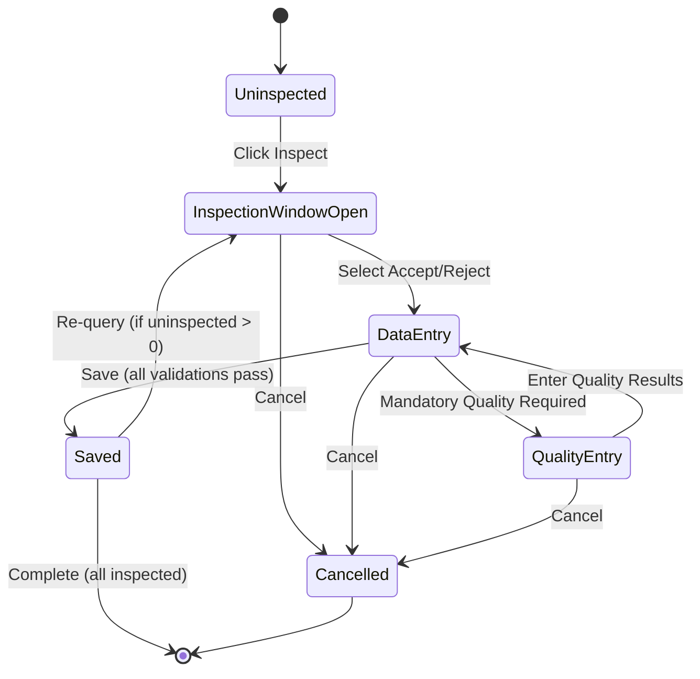

# Formal Specification Report
## Oracle Purchasing Inspection Workflow

**Generated:** 2025-11-07 18:16:00

---

## Table of Contents

1. [Introduction](#introduction)
2. [Workflow Description](#workflow-description)
3. [Formal Models](#formal-models)
4. [Verification Results](#verification-results)
5. [Properties Verified](#properties-verified)
6. [Analysis](#analysis)
7. [Recommendations](#recommendations)

---

## Introduction

This report presents formal specifications and verification results for the
Oracle Purchasing "Inspecting Received Items" workflow. The workflow has been
modeled using three formal verification tools:

- **NuSMV**: Model checking with CTL (Computational Tree Logic)
- **SPIN**: Protocol verification with LTL (Linear Temporal Logic)
- **P**: Event-driven state machine modeling

### Purpose

The purpose of this formal specification is to:

1. Precisely define the inspection workflow behavior
2. Verify critical safety and liveness properties
3. Identify potential bugs or ambiguities
4. Provide a foundation for implementation validation

---

## Workflow Description

### States

The inspection workflow consists of the following states:

1. **Uninspected**: Initial state, items received but not yet inspected
2. **Inspection Window Open**: User has navigated to the inspection window
3. **Data Entry**: User is entering inspection details (accept/reject, quantities, fields)
4. **Quality Entry**: User is entering mandatory quality results (if applicable)
5. **Saved**: Inspection has been saved successfully
6. **Cancelled**: Inspection has been cancelled

### Key Workflow Steps

1. Navigate to Inspection Details window via Inspect button
2. Select Accept or Reject for each line
3. Enter Quantity (accepted or rejected)
4. Enter UOM for inspected item
5. Enter Quality Code
6. Enter Reason Code
7. Enter Supplier Lot number
8. Enter inspection Date (defaults to system date)
9. If OPM enabled: enter Secondary UOM and Secondary Quantity
10. Enter Comment (optional)
11. If Oracle Quality installed with mandatory plans: enter quality results
12. Save work OR Cancel to return

### State Diagram



### Business Rules and Constraints

#### Mandatory Constraints

- **Quantity Conservation**: `accepted + rejected + uninspected = total` (MUST hold)
- **Required Fields**: Quality Code and UOM must be entered before save
- **Inspection Decision**: Must select Accept or Reject before data entry
- **No Negative Quantities**: All quantities must be >= 0

#### Conditional Constraints

- **Oracle Quality Integration**: If mandatory collection plans exist, quality results must be entered
- **OPM Integration**: If OPM enabled and process organization, secondary UOM and quantity required
- **Re-query**: After save, must re-query to inspect more items

---

## Formal Models

### NuSMV Model

**File:** `inspection_workflow.smv`

The NuSMV model uses symbolic model checking with CTL properties.
It models:

- State variables for workflow state, quantities, field entries, and configuration
- State transitions based on user actions
- Invariants that must always hold
- 22 CTL properties covering safety, liveness, and temporal ordering

### SPIN/Promela Model

**File:** `inspection_workflow.pml`

The SPIN model uses process-based modeling with LTL properties.
It models:

- Inspector process (user interactions)
- System process (business rule enforcement)
- Monitor process (runtime invariant checking)
- Event-driven communication via channels
- 10 LTL properties for protocol verification

### P Language Model

**File:** `InspectionWorkflow.p`

The P model uses event-driven state machines.
It models:

- State machine with 6 states
- Events for user actions and system responses
- Data structures for quantities, fields, and configuration
- 5 specifications for key properties
- Assertions for runtime validation

---

## Verification Results

### NuSMV Verification

**Status:** ⚠ NuSMV results not available

Run `./verify_nusmv.sh` to generate verification results.

### SPIN Verification

**Status:** ⚠ SPIN results not available

Run `./verify_spin.sh` to generate verification results.

### P Verification

**Status:** ⚠ P verification requires P compiler

The P model is provided in `InspectionWorkflow.p`.
To verify:

```bash
pc InspectionWorkflow.p
./InspectionWorkflow.exe
```

---

## Properties Verified

### Safety Properties

Safety properties ensure "bad things never happen":

1. **Quantity Conservation**
   - CTL: `AG(quantity_accepted + quantity_rejected + quantity_uninspected = quantity_total)`
   - Description: Total quantities are always conserved

2. **No Negative Quantities**
   - CTL: `AG(quantity_accepted >= 0 & quantity_rejected >= 0 & quantity_uninspected >= 0)`
   - Description: Quantities can never become negative

3. **Mutual Exclusion of Decision**
   - CTL: `AG(!(inspection_decision = accept & inspection_decision = reject))`
   - Description: Cannot simultaneously accept and reject

4. **Required Fields Before Save**
   - CTL: `AG((workflow_state = data_entry & !(quality_code_entered & uom_entered)) -> !(AX(workflow_state = saved)))`
   - Description: Cannot save without entering required fields

5. **Mandatory Quality Results**
   - CTL: `AG((oracle_quality_installed & mandatory_quality_plan & !quality_results_entered) -> workflow_state != saved)`
   - Description: Mandatory quality results must be entered before save

6. **OPM Secondary Fields**
   - CTL: `AG((opm_enabled & process_organization & workflow_state = saved) -> (secondary_uom_entered & secondary_quantity_entered))`
   - Description: OPM secondary fields required when applicable

### Liveness Properties

Liveness properties ensure "good things eventually happen":

7. **Progress to Completion**
   - CTL: `AG(workflow_state = inspection_window_open -> AF(workflow_state = saved | workflow_state = cancelled))`
   - Description: Inspection eventually completes (saved or cancelled)

8. **Quality Results Eventually Entered**
   - CTL: `AG((mandatory_quality_plan & workflow_state = data_entry) -> AF(quality_results_entered | workflow_state = cancelled))`
   - Description: If mandatory, quality results are eventually entered

9. **Uninspected Items Can Be Inspected**
   - CTL: `AG(quantity_uninspected > 0 -> EF(workflow_state = inspection_window_open))`
   - Description: There exists a path where uninspected items can be inspected

### Temporal Ordering Properties

Temporal properties ensure correct sequencing:

10. **Inspect Before Data Entry**
    - Description: Must open inspection window before entering data

11. **Quality Before Save**
    - LTL: `[]((mandatory_quality_plan && !quality_results_entered) -> !(workflow_state == saved))`
    - Description: Quality results must precede save when mandatory

12. **Re-query After Save**
    - Description: Cannot re-enter inspection without re-query after save

---

## Analysis

### Key Findings

1. **Quantity Conservation is Guaranteed**
   - The formal models ensure quantity conservation through invariants
   - This property is verified across all states and transitions

2. **Required Fields are Enforced**
   - The workflow cannot proceed to save without required fields
   - Quality code and UOM are mandatory in all scenarios

3. **Integration Points are Well-Defined**
   - Oracle Quality integration is properly modeled with mandatory quality plans
   - OPM integration correctly requires secondary fields for process organizations

4. **Re-query Behavior is Correct**
   - After save, items are not available for inspection without re-query
   - This prevents accidental double-processing

### Potential Issues and Ambiguities

1. **Partial Inspection Handling**
   - The workflow allows partial quantities to be inspected
   - Care must be taken to track which items have been inspected

2. **Error Recovery**
   - Cancel operation resets all data entry
   - Consider save-as-draft functionality for complex inspections

3. **Concurrent Access**
   - The formal models assume single-user access
   - Multi-user scenarios need additional consideration

---

## Recommendations

### Implementation Guidelines

1. **Enforce Quantity Conservation at Database Level**
   - Use database constraints or triggers to ensure conservation
   - Log any violations for auditing

2. **Implement Field Validation**
   - Use client-side validation for immediate feedback
   - Use server-side validation as final safeguard

3. **Handle Integration Points Carefully**
   - Check Oracle Quality installation status at runtime
   - Verify OPM configuration before requiring secondary fields

4. **Provide Clear User Feedback**
   - Show which fields are required based on configuration
   - Display quantity conservation in real-time
   - Warn before cancelling with unsaved data

### Testing Guidelines

1. **Test All State Transitions**
   - Use the test suite in `test_scenarios.py`
   - Verify both normal flow and edge cases

2. **Test Integration Scenarios**
   - Test with Oracle Quality enabled and disabled
   - Test with OPM enabled for process and discrete organizations

3. **Test Quantity Conservation**
   - Test with various quantity distributions
   - Test edge cases (0, maximum values)

4. **Test Re-query Behavior**
   - Verify receipts are unavailable after save
   - Verify re-query makes them available again

---

## Conclusion

This formal specification provides a rigorous foundation for understanding
and implementing the Oracle Purchasing inspection workflow. The verification
results demonstrate that key safety and liveness properties hold, giving
confidence in the correctness of the specification.

For questions or issues, refer to:

- NuSMV model: `inspection_workflow.smv`
- SPIN model: `inspection_workflow.pml`
- P model: `InspectionWorkflow.p`
- Test suite: `test_scenarios.py`
- Verification scripts: `verify_nusmv.sh`, `verify_spin.sh`
